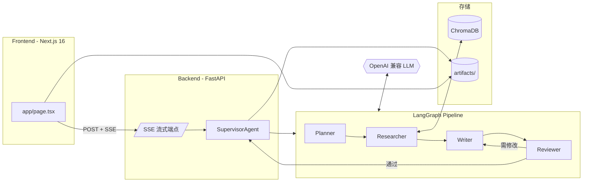

# supervisor_AGENT

基于 **FastAPI + LangGraph** 的 Agentic RAG 长文生成系统。输入主题和字数,自动完成大纲规划、知识库检索、逐节撰写、审查修订,输出结构化 Markdown 论文。

> 研究型 MVP,非生产系统。演示端到端 Agent+RAG 流水线的完整闭环。

## 特性

- **大纲生成与修订** — 根据主题自动生成大纲,支持人工反馈反复修订
- **RAG 增强检索** — ChromaDB 本地向量库,按章节标题检索 LaTeX 知识片段
- **流式逐节撰写** — SSE 实时推送,滑动窗口保持章节间连贯性
- **审查-局部重写** — Reviewer 结构化审查,仅重写不合格章节,跳过已通过的
- **来源标注** — `[source: 文件名]` 标记,可追溯引用来源
- **历史管理** — 产物持久化,支持查看、恢复、下载历史论文
- **多模型兼容** — OpenAI / DeepSeek / SiliconFlow / Kimi 等兼容 API

## 架构



## 快速开始

### 后端

```bash
cd supervisor-agent
python -m venv .venv
source .venv/bin/activate   # Windows: .venv\Scripts\Activate.ps1
pip install -r requirements.txt
cp .env.example .env         # 填入 OPENAI_API_KEY
uvicorn src.supervisor_agent.main:app --reload
```

API: `http://localhost:8000` | 文档: `http://localhost:8000/docs`

### 前端

```bash
cd frontend
npm install
npm run dev                   # http://localhost:3000
```

后端非默认地址时创建 `frontend/.env.local`: `NEXT_PUBLIC_API_BASE_URL=http://...`

### 构建知识库

```bash
cd supervisor-agent
python ingest_latex.py <latex_目录>
```

## 环境变量

`supervisor-agent/.env`:

| 变量 | 必需 | 默认值 | 说明 |
|---|---|---|---|
| `OPENAI_API_KEY` | 是 | — | API 密钥 |
| `OPENAI_BASE_URL` | 否 | OpenAI | 兼容端点地址 |
| `OPENAI_MODEL` | 否 | `gpt-4-turbo-preview` | 模型名 |
| `HOST` | 否 | `0.0.0.0` | 监听地址 |
| `PORT` | 否 | `8000` | 监听端口 |
| `LOG_LEVEL` | 否 | `INFO` | 日志级别 |

## API

所有 SSE 端点返回 `status / content / final_paper / error / done` 事件。

| Method | Path | 说明 |
|---|---|---|
| POST | `/api/generate_outline` | 流式生成大纲 |
| POST | `/api/revise_outline` | 流式修订大纲 |
| POST | `/api/confirm_and_write` | 全流程: 检索→撰写→审查→局部重写 |
| GET | `/api/artifacts` | 历史列表 |
| GET | `/api/artifacts/{id}` | 产物元数据 |
| GET | `/api/artifacts/{id}/content` | 论文正文 |
| GET | `/api/artifacts/{id}/download` | 下载 Markdown |
| GET | `/health` | 健康检查 |

## 使用流程

1. 输入**主题** + **字数上限** + 可选关键词 → 点击「生成大纲」
2. 预览大纲,可输入修改意见反复修订
3. 确认后进入全流程: 知识库检索 → 逐节撰写 → 审查 → 局部重写
4. 最终论文实时流式输出,支持下载和历史回顾

## 项目结构

```
supervisor_AGENT/
├── frontend/                   # Next.js 16 + React 19 + Tailwind v4
│   └── app/page.tsx            # 单页 UI + SSE 消费 + 历史面板
│
├── supervisor-agent/           # FastAPI + LangGraph 后端
│   ├── src/supervisor_agent/
│   │   ├── main.py             # 入口 + 全部路由
│   │   ├── agent.py            # LangGraph 驱动器 + SSE 队列
│   │   ├── graph.py            # 3 个 StateGraph 构建器
│   │   ├── nodes.py            # Planner / Revise / Researcher / Writer / Reviewer
│   │   ├── state.py            # PaperState TypedDict
│   │   ├── rag.py              # ChromaDB 检索封装
│   │   ├── artifacts.py        # 产物持久化
│   │   └── schemas/            # Pydantic 请求/响应模型
│   └── ingest_latex.py         # 离线 LaTeX 入库脚本
│
└── CLAUDE.md                   # AI 编码规范
```

## 技术栈

| 层级 | 技术 |
|---|---|
| 前端 | Next.js 16, React 19, TypeScript, Tailwind v4, shadcn/ui, react-markdown |
| 后端 | FastAPI, LangGraph, LangChain, AsyncOpenAI |
| 向量库 | ChromaDB (PersistentClient) + OpenAI Embedding |
| 存储 | 本地文件系统 (`artifacts/{task_id}/`) |
| 模型 | GPT-4 / DeepSeek / SiliconFlow / Kimi 等 OpenAI 兼容 API |

## 已知限制

- 无用户系统与认证,单租户本地运行
- 生成在请求线程内执行,无后台队列,断开 SSE 即终止
- `[source:]` 标注为 MVP 级溯源,非正式引用格式
- Reviewer 为 LLM 自审,无确定性事实校验
- 产物列表无分页,超大论文无增量补丁

## 路线图

- 引用管理器: 去重、锚点 ID、自动生成参考文献列表
- 后台任务队列: Celery + Redis,生成与请求生命周期解耦
- 确定性审查增强: 字数/结构/来源标注的正则校验
- PDF/LaTeX 导出, BibTeX 导入
- 可配置检索策略: 多查询扩展、重排序、按章节关键词覆盖

## License

MIT
